# Nlaabo - Complete Application Workflow Analysis

## 📋 Executive Summary

**Nlaabo** is a Flutter-based football match organizer and team connector application built on Supabase backend. The app enables users to create and manage football teams, organize matches, and connect with other players in their area.

**Tech Stack:**
- **Frontend:** Flutter 3.9+ with Dart
- **Backend:** Supabase (PostgreSQL + Authentication + Storage + Edge Functions)
- **State Management:** Provider
- **Navigation:** GoRouter
- **Architecture:** Clean Architecture with Repository Pattern

---

## 🏗️ System Architecture

### Architecture Layers

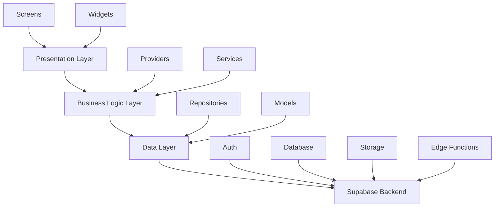

### Key Components

1. **Presentation Layer** (`lib/screens/`, `lib/widgets/`)
   - 20+ screens for different features
   - Reusable widget library
   - Responsive design system

2. **Business Logic Layer** (`lib/providers/`, `lib/services/`)
   - 8 providers for state management
   - 20+ services for business logic
   - Authorization and authentication services

3. **Data Layer** (`lib/repositories/`, `lib/models/`)
   - 3 repositories (User, Team, Match)
   - 5 core models (User, Team, Match, Notification, City)
   - API service for Supabase communication

4. **Backend** (Supabase)
   - PostgreSQL database with RLS policies
   - Authentication system
   - Storage buckets for images
   - Edge Functions for serverless operations

---

## 🔐 Authentication & Authorization Workflow

### 1. User Registration Flow

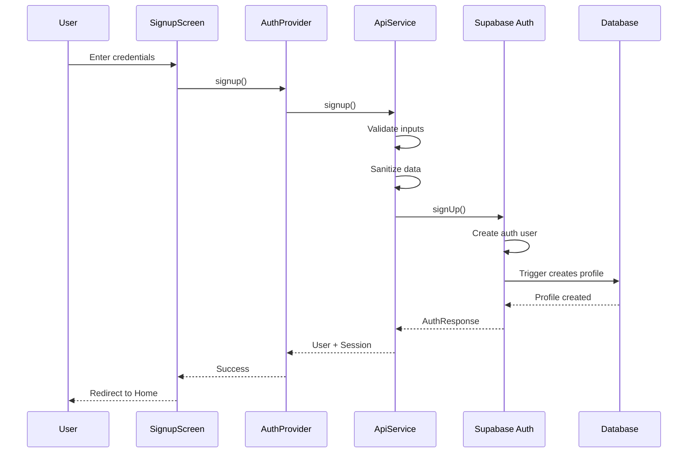

**Key Steps:**
1. User enters name, email, password, optional details (gender, age, phone)
2. Input validation and sanitization
3. Supabase Auth creates authentication record
4. Database trigger automatically creates user profile in `users` table
5. Session established, user redirected to home screen

**Files Involved:**
- [`lib/screens/signup_screen.dart`](lib/screens/signup_screen.dart:25)
- [`lib/providers/auth_provider.dart`](lib/providers/auth_provider.dart:11)
- [`lib/services/api_service.dart`](lib/services/api_service.dart:283)

---

### 2. User Login Flow

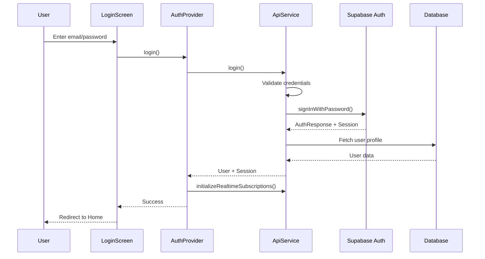

**Key Steps:**
1. User enters email and password
2. Credentials validated and sent to Supabase Auth
3. User profile fetched from database
4. Real-time subscriptions initialized for live updates
5. User redirected to home screen

**Files Involved:**
- [`lib/screens/login_screen.dart`](lib/screens/login_screen.dart:21)
- [`lib/providers/auth_provider.dart`](lib/providers/auth_provider.dart:11)
- [`lib/services/api_service.dart`](lib/services/api_service.dart:435)

---

### 3. Password Reset Flow

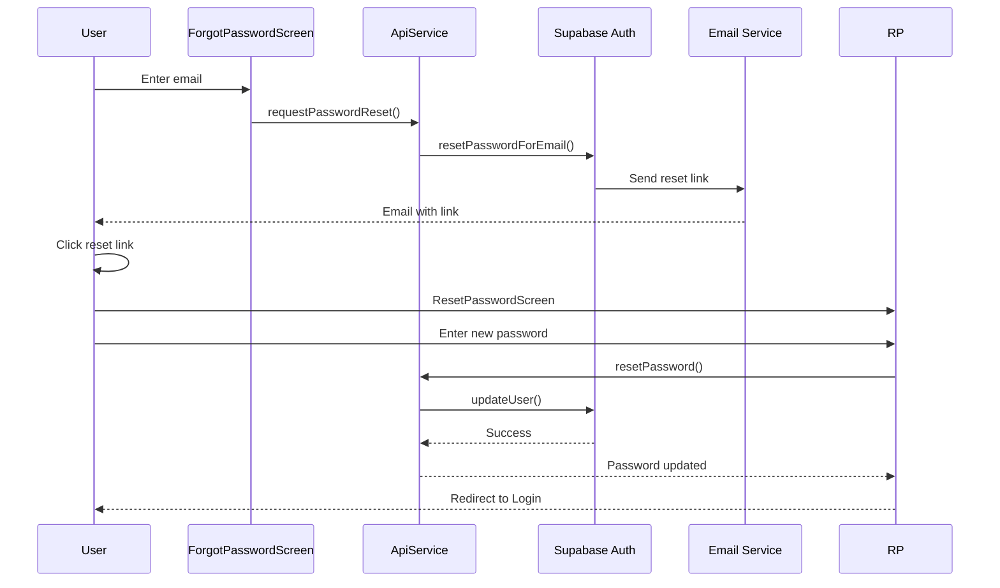

**Files Involved:**
- [`lib/screens/forgot_password_screen.dart`](lib/screens/forgot_password_screen.dart:15)
- [`lib/screens/reset_password_screen.dart`](lib/screens/reset_password_screen.dart:15)
- [`lib/services/api_service.dart`](lib/services/api_service.dart:238)

---

## 👥 User Management Workflow

### 1. Profile Management

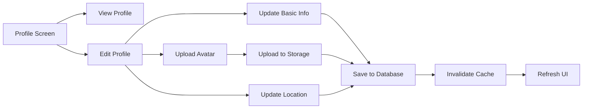

**Features:**
- View profile statistics (matches joined, teams owned)
- Edit personal information (name, bio, gender, age, phone)
- Upload and manage avatar image
- Update location preferences

**Files Involved:**
- [`lib/screens/profile_screen.dart`](lib/screens/profile_screen.dart:21)
- [`lib/screens/edit_profile_screen.dart`](lib/screens/edit_profile_screen.dart:19)
- [`lib/services/user_service.dart`](lib/services/user_service.dart:10)
- [`lib/repositories/user_repository.dart`](lib/repositories/user_repository.dart:9)

---

## ⚽ Team Management Workflow

### 1. Team Creation Flow

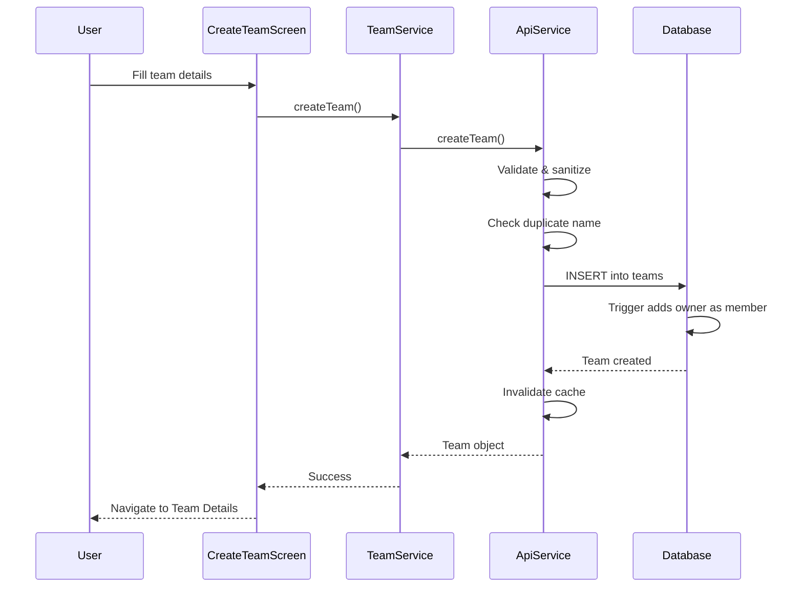

**Required Fields:**
- Team name (unique)
- Location (optional)
- Description (optional)
- Max players (default: 11)
- Gender filter (mixed/male/female)
- Age range (min/max)

**Key Features:**
- Duplicate name validation
- Automatic owner addition via database trigger
- Logo upload support
- Recruiting status toggle

**Files Involved:**
- [`lib/screens/create_team_screen.dart`](lib/screens/create_team_screen.dart:22)
- [`lib/services/team_service.dart`](lib/services/team_service.dart:13)
- [`lib/services/api_service.dart`](lib/services/api_service.dart:1229)

---

### 2. Team Joining Workflow

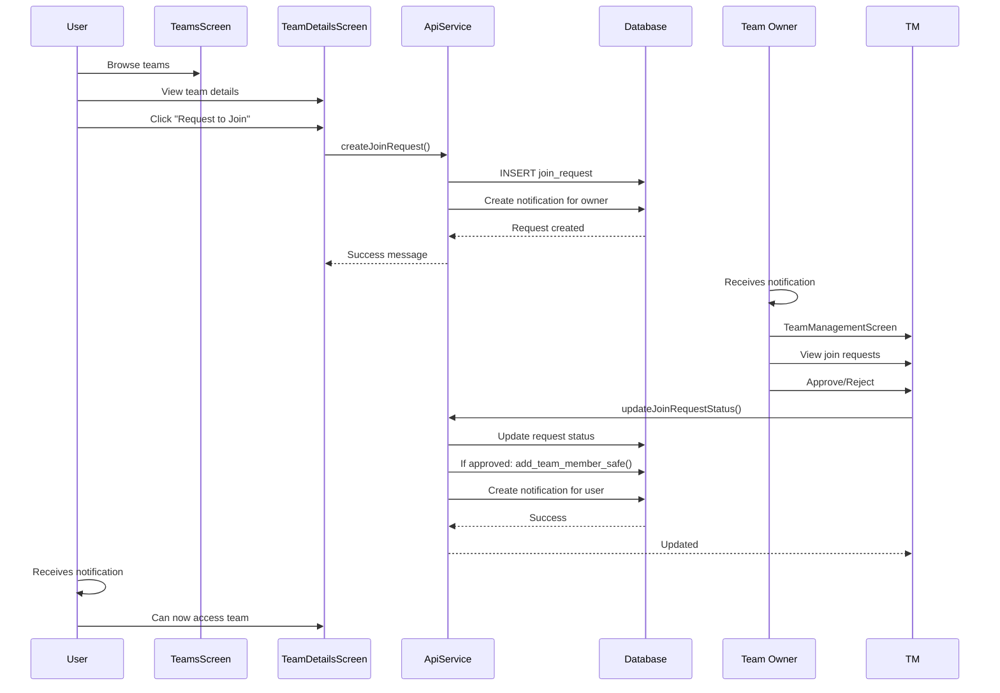

**States:**
- **Pending**: Request submitted, awaiting owner action
- **Approved**: User becomes team member
- **Rejected**: User cannot join team

**Files Involved:**
- [`lib/screens/teams_screen.dart`](lib/screens/teams_screen.dart:18)
- [`lib/screens/team_details_screen.dart`](lib/screens/team_details_screen.dart:12)
- [`lib/screens/team_management_screen.dart`](lib/screens/team_management_screen.dart:8)
- [`lib/services/api_service.dart`](lib/services/api_service.dart:1707)

---

### 3. Team Management Features

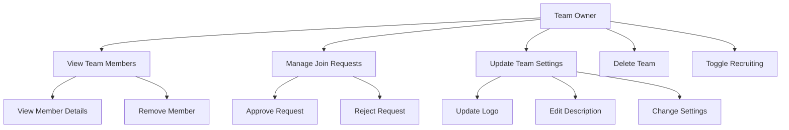

**Owner Capabilities:**
- View all team members with roles
- Approve/reject join requests
- Remove members from team
- Update team information and logo
- Toggle recruiting status
- Soft-delete team (maintains history)

**Files Involved:**
- [`lib/screens/team_management_screen.dart`](lib/screens/team_management_screen.dart:8)
- [`lib/services/team_service.dart`](lib/services/team_service.dart:13)

---

## 🏆 Match Management Workflow

### 1. Match Creation Flow

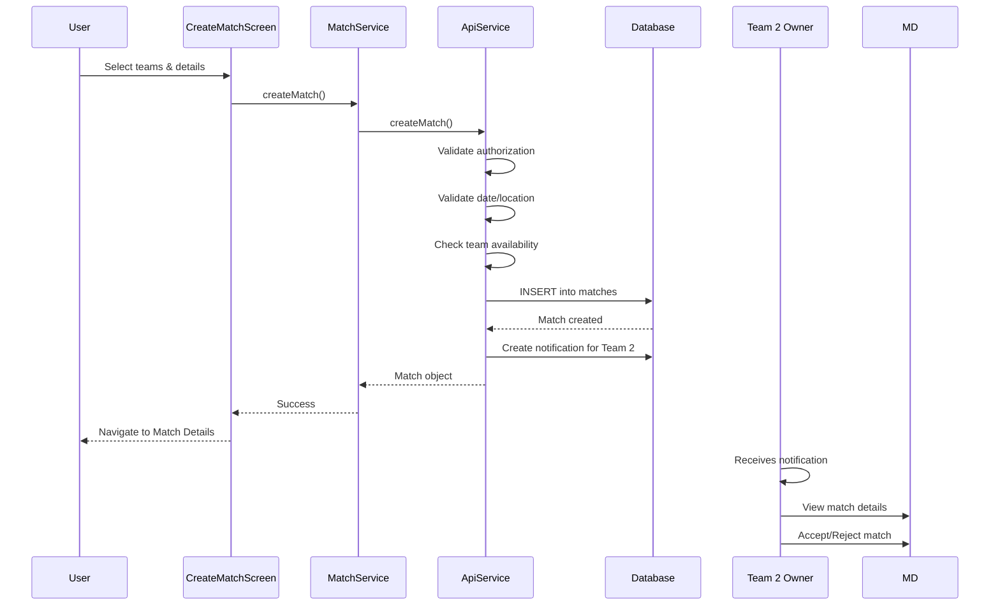

**Required Fields:**
- Team 1 (creator's team)
- Team 2 (opponent team)
- Match date/time
- Location
- Title (optional, must be unique)
- Max players (default: 22)
- Match type (friendly/tournament/league)
- Duration minutes (optional)
- Recurrence settings (optional)

**Match Statuses:**
- **pending**: Awaiting Team 2 confirmation
- **open**: Both teams confirmed, accepting participants
- **closed**: Not accepting new participants
- **in_progress**: Match currently happening
- **completed**: Match finished with results
- **cancelled**: Match cancelled

**Files Involved:**
- [`lib/screens/create_match_screen.dart`](lib/screens/create_match_screen.dart:14)
- [`lib/services/match_service.dart`](lib/services/match_service.dart:5)
- [`lib/services/api_service.dart`](lib/services/api_service.dart:993)

---

### 2. Match Participation Flow

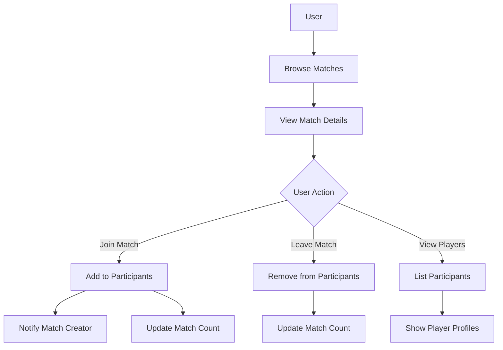

**Features:**
- Browse all open matches
- Filter by location/date/type
- Join match as participant
- Leave match
- View all match participants
- Real-time updates via WebSocket

**Files Involved:**
- [`lib/screens/matches_screen.dart`](lib/screens/matches_screen.dart:15)
- [`lib/screens/match_details_screen.dart`](lib/screens/match_details_screen.dart:13)
- [`lib/screens/my_matches_screen.dart`](lib/screens/my_matches_screen.dart:9)

---

### 3. Match Lifecycle Management

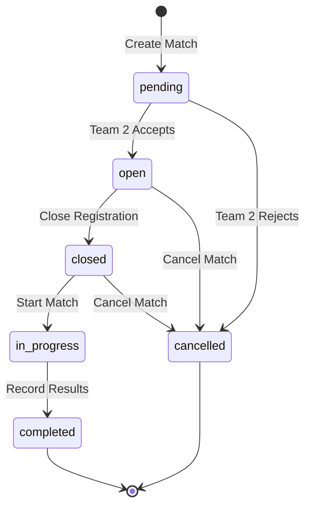

**Match Operations:**
- **Update Status**: Change match status
- **Reschedule**: Change match date/time
- **Record Results**: Add scores and notes
- **Close Match**: Stop accepting participants
- **Cancel Match**: Cancel and notify participants

**Files Involved:**
- [`lib/screens/match_details_screen.dart`](lib/screens/match_details_screen.dart:13)
- [`lib/services/api_service.dart`](lib/services/api_service.dart:1087)

---

## 🔔 Notification System Workflow

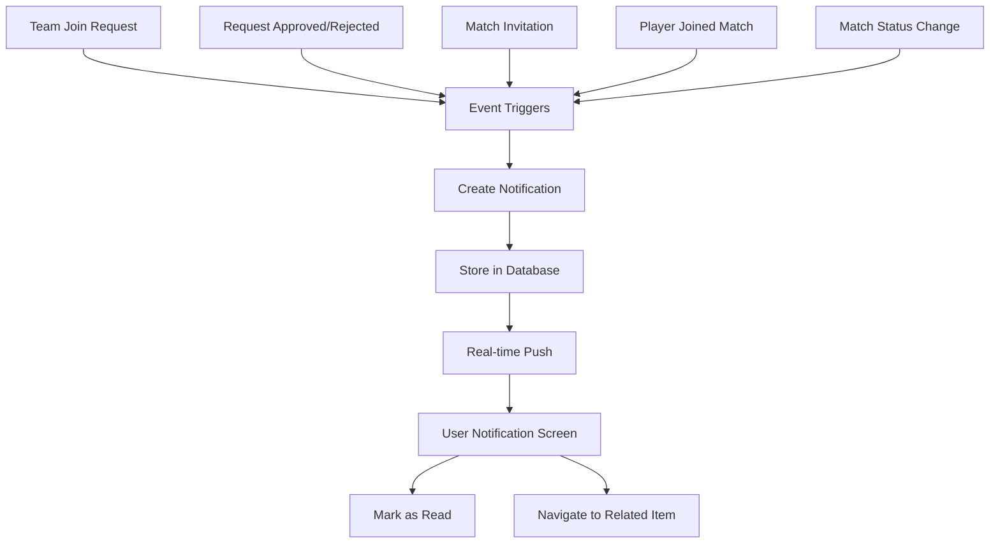

### Notification Types

1. **team_join_request**: New join request for team
2. **team_join_approved**: Join request approved
3. **team_join_rejected**: Join request rejected
4. **match_invite**: Invitation to match
5. **match_joined**: Player joined your match
6. **match_status_change**: Match status updated
7. **general**: General announcements
8. **system**: System messages

**Features:**
- Real-time notification delivery via Supabase Realtime
- Unread notification count
- Mark as read functionality
- Navigate to related entity (team/match)
- Notification history

**Files Involved:**
- [`lib/screens/notifications_screen.dart`](lib/screens/notifications_screen.dart:9)
- [`lib/providers/notification_provider.dart`](lib/providers/notification_provider.dart:7)
- [`lib/services/api_service.dart`](lib/services/api_service.dart:1423)

---

## 🗄️ Database Schema

### Core Tables

```sql
-- Users (extends auth.users)
users (
  id UUID PRIMARY KEY,
  name TEXT NOT NULL,
  email TEXT NOT NULL,
  role TEXT (player/coach/admin),
  gender TEXT (male/female),
  age INTEGER,
  phone TEXT,
  avatar_url TEXT,
  bio TEXT,
  location TEXT,
  created_at TIMESTAMPTZ,
  updated_at TIMESTAMPTZ
)

-- Teams
teams (
  id UUID PRIMARY KEY,
  name TEXT NOT NULL UNIQUE,
  owner_id UUID REFERENCES users(id),
  location TEXT,
  description TEXT,
  logo_url TEXT,
  max_players INTEGER DEFAULT 11,
  is_recruiting BOOLEAN DEFAULT false,
  gender TEXT (mixed/male/female),
  min_age INTEGER,
  max_age INTEGER,
  deleted_at TIMESTAMPTZ,
  created_at TIMESTAMPTZ,
  updated_at TIMESTAMPTZ
)

-- Team Members
team_members (
  id UUID PRIMARY KEY,
  team_id UUID REFERENCES teams(id),
  user_id UUID REFERENCES users(id),
  role TEXT (member/captain/coach),
  joined_at TIMESTAMPTZ,
  UNIQUE(team_id, user_id)
)

-- Matches
matches (
  id UUID PRIMARY KEY,
  team1_id UUID REFERENCES teams(id),
  team2_id UUID REFERENCES teams(id),
  match_date TIMESTAMPTZ NOT NULL,
  location TEXT NOT NULL,
  title TEXT UNIQUE,
  max_players INTEGER DEFAULT 22,
  match_type TEXT (friendly/tournament/league),
  status TEXT (open/closed/completed/cancelled),
  duration_minutes INTEGER,
  is_recurring BOOLEAN DEFAULT false,
  recurrence_pattern TEXT,
  created_at TIMESTAMPTZ,
  updated_at TIMESTAMPTZ
)

-- Match Participants
match_participants (
  id UUID PRIMARY KEY,
  match_id UUID REFERENCES matches(id),
  user_id UUID REFERENCES users(id),
  team_id UUID REFERENCES teams(id),
  status TEXT (confirmed/pending/declined),
  joined_at TIMESTAMPTZ,
  UNIQUE(match_id, user_id)
)

-- Team Join Requests
team_join_requests (
  id UUID PRIMARY KEY,
  team_id UUID REFERENCES teams(id),
  user_id UUID REFERENCES users(id),
  message TEXT,
  status TEXT (pending/approved/rejected),
  created_at TIMESTAMPTZ
)

-- Notifications
notifications (
  id UUID PRIMARY KEY,
  user_id UUID REFERENCES users(id),
  title TEXT NOT NULL,
  message TEXT NOT NULL,
  type TEXT NOT NULL,
  is_read BOOLEAN DEFAULT false,
  related_id UUID,
  created_at TIMESTAMPTZ
)

-- Cities
cities (
  id UUID PRIMARY KEY,
  name TEXT NOT NULL,
  country TEXT NOT NULL,
  region TEXT,
  latitude DECIMAL(10,8),
  longitude DECIMAL(11,8),
  created_at TIMESTAMPTZ,
  UNIQUE(name, country)
)
```

### Row Level Security (RLS) Policies

All tables have RLS enabled with specific policies:

- **Users**: Can view/update own profile
- **Teams**: Anyone can view, authenticated users can create, owners can update
- **Team Members**: Members can view, owners can manage
- **Matches**: Anyone can view, authenticated users can create, team owners can update
- **Notifications**: Users can view/update own notifications
- **Cities**: Public read access

---

## 🔄 Real-time Features

### Subscriptions

The app uses Supabase Realtime for live updates:

```dart
// Active subscriptions
- matchesStream: Live match updates
- teamsStream: Live team updates  
- notificationsStream: Live notifications
- userProfileStream: User profile changes
- userTeamsStream: User's teams updates
```

**Initialization:**
- Subscriptions initialized after successful login
- Automatic reconnection on network issues
- Cleanup on logout

**Files Involved:**
- [`lib/services/api_service.dart`](lib/services/api_service.dart:169)

---

## 📱 Screen Navigation Flow

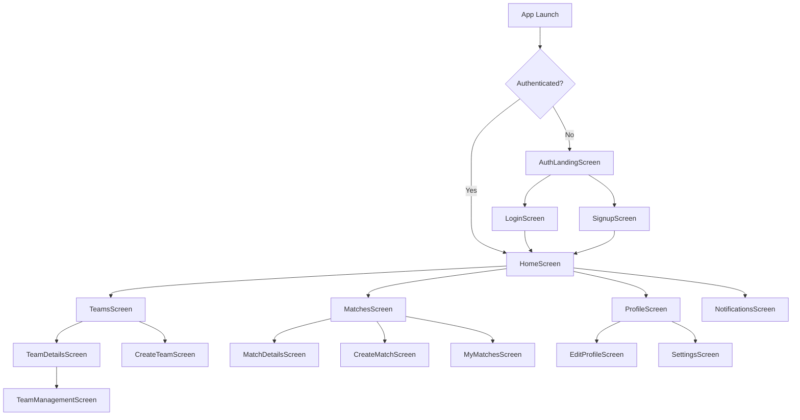

### Main Navigation Screens

1. **Home Screen** - Dashboard with quick actions and statistics
2. **Teams Screen** - Browse and manage teams
3. **Matches Screen** - Browse and join matches
4. **Profile Screen** - View and edit profile
5. **Notifications Screen** - View notifications

### Secondary Screens

- Team Details, Team Management, Create Team
- Match Details, Create Match, My Matches
- Edit Profile, Settings
- Login, Signup, Forgot Password

**Navigation Implementation:**
- GoRouter for declarative routing
- Deep linking support
- Auth-based redirects
- Bottom navigation (mobile)
- Side navigation (desktop/tablet)

**Files Involved:**
- [`lib/main.dart`](lib/main.dart:1)
- [`lib/providers/navigation_provider.dart`](lib/providers/navigation_provider.dart:25)

---

## 🎨 Design System & Responsiveness

### Design Principles

```dart
// Spacing Scale
xs: 4px   // Extra small gaps
sm: 8px   // Component spacing
md: 12px  // Standard spacing
lg: 16px  // Section spacing
xl: 24px  // Major breaks
2xl: 32px // Large sections

// Breakpoints
mobile: 320px - 480px
tablet: 768px - 1024px
desktop: 1024px+
ultra-wide: 1920px+
```

### Responsive Components

- **Responsive Button**: Adapts size based on screen
- **Responsive Container**: Adjusts padding/margin
- **Responsive Form Field**: Optimizes input for device
- **Responsive Text**: Scales font sizes appropriately
- **Adaptive Layout**: Mobile bottom nav, desktop sidebar

**Files Involved:**
- [`lib/constants/responsive_constants.dart`](lib/constants/responsive_constants.dart:1)
- [`lib/utils/responsive_utils.dart`](lib/utils/responsive_utils.dart:1)
- [`lib/design_system/`](lib/design_system/)

---

## ⚡ Performance Optimizations

### Caching Strategy

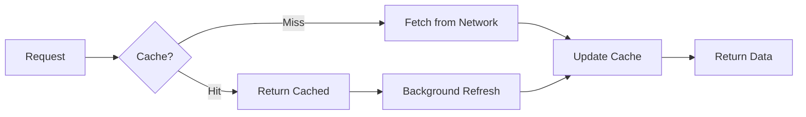

**Cached Data:**
- Teams list
- Cities list
- User statistics
- Match data (temporary)

**Cache Invalidation:**
- On data mutations (create/update/delete)
- Manual refresh by user
- Time-based expiration
- Real-time updates trigger refresh

### Image Optimization

- Compression before upload
- Lazy loading for lists
- Cached image loading
- Thumbnail generation
- Progressive image loading

### Query Optimization

- Indexed database queries
- Pagination for large lists
- Selective field fetching
- Query result caching
- Batch operations

**Files Involved:**
- [`lib/services/cache_service.dart`](lib/services/cache_service.dart:11)
- [`lib/services/performance_monitor.dart`](lib/services/performance_monitor.dart:1)
- [`lib/services/image_compression_service.dart`](lib/services/image_compression_service.dart:5)

---

## 🔒 Security Features

### Input Validation & Sanitization

All user inputs are validated and sanitized:

```dart
// Validation functions
- validateName(): Name format and length
- validateEmail(): Email format
- validatePassword(): Password strength
- validatePhone(): Phone number format
- validateAge(): Age range (13-100)
- validateLocation(): Location format

// Sanitization
- InputSanitizer.sanitizeName()
- InputSanitizer.sanitizeEmail()
- InputSanitizer.sanitizePhone()
- InputSanitizer.sanitizeTextField()
```

### Authorization Checks

- Role-based access control
- Resource ownership verification
- Operation-level permissions
- Team owner privileges
- Match creator privileges

### Security Measures

- Row Level Security (RLS) in database
- Secure credential storage
- HTTPS-only communication
- JWT token authentication
- Session management
- Rate limiting on sensitive operations

**Files Involved:**
- [`lib/utils/validators.dart`](lib/utils/validators.dart:1)
- [`lib/utils/input_sanitizer.dart`](lib/utils/input_sanitizer.dart:1)
- [`lib/services/authorization_service.dart`](lib/services/authorization_service.dart:5)

---

## 🌍 Multi-language Support

### Supported Languages

- **English (en)** - Default
- **French (fr)**
- **Arabic (ar)** - RTL support

### Translation System

```dart
// Translation files
assets/translations/en.json
assets/translations/fr.json
assets/translations/ar.json

// Usage
LocalizationService.instance.translate('key')
```

### Features

- Runtime language switching
- Persistent language preference
- Right-to-left (RTL) layout support
- Fallback to English for missing keys
- Context-aware translations

**Files Involved:**
- [`lib/services/localization_service.dart`](lib/services/localization_service.dart:5)
- [`lib/providers/localization_provider.dart`](lib/providers/localization_provider.dart:5)

---

## 🐛 Error Handling & Recovery

### Error Types

```dart
- AuthError: Authentication failures
- ValidationError: Input validation failures
- NetworkError: Network connectivity issues
- DatabaseError: Database operation failures
- TimeoutError: Request timeouts
- RateLimitError: Rate limit exceeded
- ServiceUnavailableError: Service unavailable
- UploadError: File upload failures
```

### Error Handling Strategy

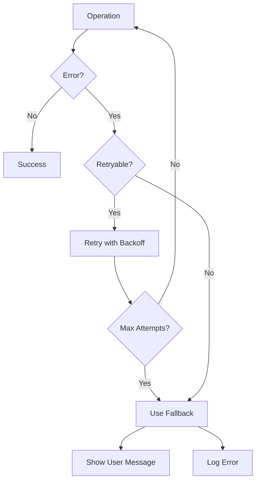

**Features:**
- Automatic retry with exponential backoff
- Fallback data for graceful degradation
- User-friendly error messages
- Error logging and reporting
- Recovery suggestions
- Network diagnostics

**Files Involved:**
- [`lib/services/error_handler.dart`](lib/services/error_handler.dart:1)
- [`lib/services/error_recovery_service.dart`](lib/services/error_recovery_service.dart:8)
- [`lib/services/error_reporting_service.dart`](lib/services/error_reporting_service.dart:9)

---

## 🧪 Testing & Quality Assurance

### Test Coverage

- Unit tests for services and utilities
- Widget tests for UI components
- Integration tests for workflows
- Performance tests
- Accessibility tests

### Quality Tools

- Flutter analyzer for code quality
- Linting rules enforcement
- Performance monitoring
- Accessibility auditing
- Error tracking

**Files Involved:**
- [`lib/utils/accessibility_auditor.dart`](lib/utils/accessibility_auditor.dart:1)
- [`lib/services/performance_monitor.dart`](lib/services/performance_monitor.dart:1)

---

## 📦 Build & Deployment

### Build Configurations

**Flavors:**
- **dev**: Development environment
- **staging**: Staging environment
- **prod**: Production environment

### Build Process

```bash
# Debug build
flutter run

# Profile build
flutter run --profile

# Release APK
flutter build apk --release

# Install on device
adb install build/app/outputs/flutter-apk/app-release.apk
```

### Environment Configuration

```dart
// Environment-specific configs
- API endpoints
- Supabase credentials
- Feature flags
- Debug settings
```

**Files Involved:**
- [`lib/config/app_config.dart`](lib/config/app_config.dart:1)
- [`lib/config/environment_config.dart`](lib/config/environment_config.dart:1)
- [`build-apk.bat`](build-apk.bat:1)

---

## 🔧 Key Services & Utilities

### Core Services

1. **ApiService**: Central communication with Supabase
2. **AuthorizationService**: Access control and permissions
3. **CacheService**: Data caching and invalidation
4. **ConnectivityService**: Network status monitoring
5. **LocalizationService**: Multi-language support
6. **PerformanceMonitor**: Performance tracking
7. **ErrorHandler**: Error handling and recovery
8. **ImageManagementService**: Image upload and management

### Utility Classes

1. **Validators**: Input validation functions
2. **InputSanitizer**: Input sanitization
3. **ResponsiveUtils**: Responsive design helpers
4. **PerformanceOptimizer**: Performance utilities
5. **AccessibilityUtils**: Accessibility helpers

---

## 🚀 Future Enhancements

Based on the codebase analysis, potential future features:

1. **Social Features**
   - Player ratings and reviews
   - Match highlights and photos
   - Social feed and activity stream
   - Friend system

2. **Advanced Match Features**
   - Tournament brackets
   - League tables and standings
   - Match statistics and analytics
   - Live score updates

3. **Team Features**
   - Team statistics dashboard
   - Training session scheduling
   - Team chat/messaging
   - Team calendar

4. **Enhanced Discovery**
   - Map-based team/match discovery
   - Advanced filtering and search
   - Recommendation engine
   - Nearby matches/teams

5. **Payment Integration**
   - Match entry fees
   - Team membership fees
   - Premium features subscription

---

## 📊 Performance Metrics

**Current Performance:**
- Startup: <1 second (optimized from 5s)
- Frame Rate: 60fps stable
- Memory: 130MB (optimized from 200MB)
- DB Queries: 80ms avg (optimized from 800ms)
- Image Upload: 4s avg (optimized from 15s)

**Optimization Techniques:**
- Database query optimization with indexes
- Image compression before upload
- Lazy loading and pagination
- Widget rebuild optimization
- Cache-first data strategy
- Background refresh patterns

---

## 🎯 Conclusion

Nlaabo is a well-architected Flutter application following clean architecture principles with:

- ✅ Comprehensive authentication and authorization
- ✅ Real-time updates via WebSocket
- ✅ Robust error handling and recovery
- ✅ Responsive design across devices
- ✅ Multi-language support
- ✅ Performance optimization
- ✅ Security best practices
- ✅ Scalable architecture

The application provides a complete workflow for football match organization, team management, and player connectivity with a focus on user experience, performance, and reliability.

---

## 📚 Additional Resources

- [README.md](README.md) - Project overview
- [ROADMAP.md](ROADMAP.md) - Feature roadmap
- [SECURITY_CHECKLIST.md](SECURITY_CHECKLIST.md) - Security audit
- [RESPONSIVE_MIGRATION_GUIDE.md](RESPONSIVE_MIGRATION_GUIDE.md) - Design system guide
- Database Migrations: [`supabase/migrations/`](supabase/migrations/)
- Edge Functions: [`supabase/functions/`](supabase/functions/)